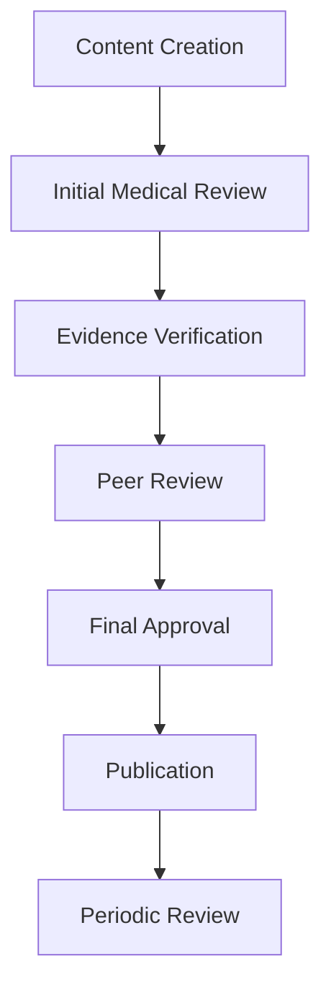
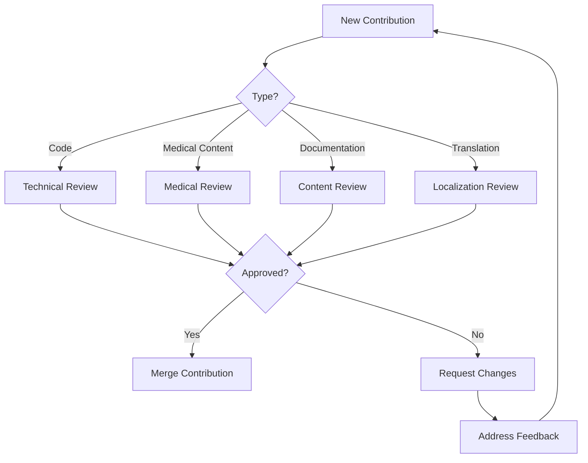

# Comprehensive Contribution Guidelines & Development Workflow

## 🎯 Table of Contents

- [Welcome](#welcome)
- [Project Overview](#project-overview)
- [Quick Start Guide](#quick-start-guide)
- [Development Environment Setup](#development-environment-setup)
- [Branch Management Strategy](#branch-management-strategy)
- [Code Standards & Best Practices](#code-standards--best-practices)
- [Medical App Specific Requirements](#medical-app-specific-requirements)
- [Quality Assurance Processes](#quality-assurance-processes)
- [Pull Request Process](#pull-request-process)
- [Community & Communication](#community--communication)
- [Templates & Checklists](#templates--checklists)
- [Troubleshooting & FAQ](#troubleshooting--faq)

---

## 🎯 Welcome

### 👋 Welcome Contributors!

Thank you for your interest in contributing to **SUPLEMENTOR** - the comprehensive Polish educational platform for evidence-based supplement and nootropic education. We welcome contributions from developers, medical professionals, researchers, translators, and anyone passionate about advancing supplement education.

### 🌟 Our Mission

To provide accurate, evidence-based, and accessible information about supplements and nootropics to Polish-speaking users worldwide, with a focus on:

- **Medical Accuracy**: Evidence-based content reviewed by healthcare professionals
- **Educational Excellence**: Interactive 3D brain visualizations and comprehensive learning tools
- **Cultural Relevance**: Full Polish localization with culturally appropriate medical terminology
- **Accessibility**: WCAG 2.1 AA compliance for inclusive education

### 🤝 Contribution Philosophy

We believe in:
- **Collaborative Development**: Every contribution matters, from code to translations
- **Medical Responsibility**: All health claims must be evidence-based and professionally reviewed
- **Inclusive Excellence**: Building tools that serve diverse Polish-speaking communities
- **Continuous Learning**: Evolving our platform based on user needs and scientific advances

---

## 🎯 Project Overview

### 🏗️ Architecture Overview

**SUPLEMENTOR** is built with modern web technologies optimized for educational content delivery:

```
┌─────────────────────────────────────────────────────────────────┐
│                        SUPLEMENTOR Platform                     │
├─────────────────────────────────────────────────────────────────┤
│  🌐 Frontend Layer                                             │
│  ├── Next.js 15.3.3 (App Router)                              │
│  ├── React 19 + TypeScript 5.8.3+                             │
│  ├── TailwindCSS 4.0.9 + shadcn/ui                           │
│  └── Three.js + React Three Fiber (3D Visualizations)         │
├─────────────────────────────────────────────────────────────────┤
│  🔧 State Management                                           │
│  ├── Zustand (Slice-based stores)                             │
│  ├── TanStack Query (Server state)                            │
│  └── tRPC (Type-safe API layer)                               │
├─────────────────────────────────────────────────────────────────┤
│  🗄️ Data Layer                                                 │
│  ├── Prisma ORM (Type-safe database)                          │
│  ├── MongoDB (Document database)                              │
│  └── Redis (Caching layer)                                    │
├─────────────────────────────────────────────────────────────────┤
│  ✅ Quality Assurance                                          │
│  ├── Biome (Linting & Formatting)                             │
│  ├── Vitest (Unit & Integration tests)                        │
│  ├── Playwright (E2E tests)                                   │
│  └── Accessibility Testing (WCAG 2.1 AA)                     │
└─────────────────────────────────────────────────────────────────┘
```

### 📊 Key Features

| Feature Category | Technologies | Purpose |
|-----------------|-------------|---------|
| **3D Brain Visualization** | Three.js, React Three Fiber | Interactive neuroanatomy education |
| **Supplement Database** | Prisma, MongoDB | Comprehensive evidence-based catalog |
| **Polish Localization** | Next-i18n, Custom hooks | Full Polish language support |
| **Medical Validation** | Professional review system | Evidence-based content verification |
| **Interactive Learning** | D3.js, Framer Motion | Engaging educational experiences |
| **Stack Builder** | @dnd-kit, Zustand | Personalized supplement recommendations |

### 🎯 Target Audience

- **Medical Students**: Interactive neuroanatomy and pharmacology education
- **Healthcare Professionals**: Evidence-based supplement information
- **Biohackers & Enthusiasts**: Safe supplement experimentation guidance
- **Researchers**: Latest scientific findings and interaction data
- **General Public**: Accessible health optimization information

---

## 🚀 Quick Start Guide

### Prerequisites

**Required Software:**
- **Node.js 20+** (LTS recommended)
- **Bun 1.1.38+** (Package manager for better performance)
- **Git 2.30+** (Version control)
- **Visual Studio Code** (Recommended IDE)

**Recommended Tools:**
- **Docker Desktop** (For database development)
- **Postman** (API testing)
- **Figma** (Design system access)

### ⚡ One-Command Setup

```bash
# 1. Clone with submodules
git clone --recursive https://github.com/your-org/suplementor.git
cd suplementor

# 2. Install dependencies (Bun for speed)
bun install

# 3. Set up environment
cp .env.example .env.local
# Edit .env.local with your configuration

# 4. Initialize database
bun run db:reset

# 5. Start development server
bun run dev
```

**🎉 Access your app at:** `http://localhost:3000`

### 🔧 Environment Configuration

**Required Environment Variables:**

```bash
# .env.local
NEXT_PUBLIC_APP_URL=http://localhost:3000
NEXT_PUBLIC_API_URL=http://localhost:3000/api

# Database
DATABASE_URL="mongodb://localhost:27017/suplementor"
DIRECT_URL="mongodb://localhost:27017/suplementor"

# Authentication (Development)
NEXTAUTH_SECRET="your-secret-key-here"
NEXTAUTH_URL="http://localhost:3000"

# Optional: Analytics
NEXT_PUBLIC_GA_ID="G-XXXXXXXXXX"
```

---

## 🏗️ Development Environment Setup

### 🛠️ IDE Configuration

#### Visual Studio Code Setup

**Required Extensions:**
```json
{
  "recommendations": [
    "bradlc.vscode-tailwindcss",
    "esbenp.prettier-vscode",
    "dbaeumer.vscode-eslint",
    "ms-vscode.vscode-typescript-next",
    "prisma.prisma",
    "ms-playwright.playwright",
    "biomejs.biome",
    "formulahendry.auto-rename-tag",
    "christian-kohler.path-intellisense",
    "ms-vscode.vscode-json"
  ]
}
```

**Workspace Settings:**
```json
// .vscode/settings.json
{
  "typescript.preferences.preferTypeOnlyAutoImports": true,
  "editor.formatOnSave": true,
  "editor.defaultFormatter": "biomejs.biome",
  "editor.codeActionsOnSave": {
    "source.fixAll.eslint": "explicit",
    "source.organizeImports": "explicit"
  },
  "tailwindCSS.experimental.classRegex": [
    ["cva\\(([^)]*)\\)", "[\"'`]([^\"'`]*).*?[\"'`]"],
    ["cx\\(([^)]*)\\)", "(?:'|\"|`)([^']*)(?:'|\"|`)"]
  ]
}
```

### 🗃️ Database Setup

#### Local MongoDB Setup

```bash
# Using Docker (Recommended)
docker run -d \
  --name suplementor-mongo \
  -p 27017:27017 \
  -e MONGO_INITDB_ROOT_USERNAME=admin \
  -e MONGO_INITDB_ROOT_PASSWORD=password \
  mongo:latest

# Generate Prisma client
bun run prisma:generate

# Run migrations
bun run migrate
```

#### Database Management Commands

```bash
# Reset database (development only)
bun run db:reset

# Seed with sample data
bun run db:seed

# Check database health
bun run db:health

# View database in browser
bun run prisma:studio
```

### 🧪 Testing Environment

#### Running Test Suites

```bash
# Run all tests
bun run test:all

# Unit tests only
bun run test:run

# E2E tests only
bun run test:e2e

# Test with coverage
bun run test:coverage

# Visual regression tests
bun run test:e2e:headed
```

#### Test Database Setup

```bash
# Create test database
docker run -d \
  --name suplementor-test \
  -p 27018:27017 \
  mongo:latest

# Run tests with test database
DATABASE_URL="mongodb://localhost:27018/suplementor-test" bun run test:all
```

---

## 🌿 Branch Management Strategy

### 📋 Branch Naming Convention

```
<type>/<scope>-<description>

Types: feature, bugfix, refactor, hotfix, docs, test, chore
Scope: component-name, api, db, ui, i18n, etc.
Description: kebab-case-description
```

**Examples:**
```bash
feature/supplement-categories
bugfix/accessibility-navbar
refactor/component-optimization
hotfix/critical-security-patch
docs/medical-content-guidelines
test/e2e-supplement-search
chore/dependency-updates
```

### 🚀 Git Workflow

#### Feature Development Workflow

```bash
# 1. Create feature branch from develop
git checkout develop
git pull origin develop
git checkout -b feature/amazing-new-feature

# 2. Develop with atomic commits
git add .
git commit -m "feat: add supplement category filter

- Add dropdown component for category selection
- Implement filtering logic in Zustand store
- Add Polish translations for all categories
- Include unit tests for filter functionality"

# 3. Keep branch updated
git fetch origin develop
git rebase origin/develop

# 4. Push and create PR
git push origin feature/amazing-new-feature
```

#### Hotfix Workflow (Production Issues)

```bash
# 1. Create hotfix branch from main
git checkout main
git checkout -b hotfix/critical-security-patch

# 2. Fix the issue
git add .
git commit -m "fix: resolve critical security vulnerability

- Patch XSS vulnerability in supplement search
- Add input sanitization middleware
- Update dependencies to secure versions"

# 3. Deploy immediately
git push origin hotfix/critical-security-patch
# Create PR to main with emergency merge
```

### 🔄 Release Branches

#### Release Preparation

```bash
# 1. Create release branch
git checkout develop
git checkout -b release/v1.2.0

# 2. Update version numbers
# Update package.json version
# Update changelog
# Run full test suite

# 3. Create release PR
git add .
git commit -m "release: prepare v1.2.0

- Update version to 1.2.0
- Add changelog entries
- Pass all quality checks"

# 4. Merge to main
git checkout main
git merge release/v1.2.0
git tag v1.2.0
git push origin main --tags
```

---

## 📝 Code Standards & Best Practices

### 🎯 TypeScript Excellence

#### Strict Mode Requirements

**All code must pass TypeScript strict mode checks:**

```typescript
// ✅ Excellent TypeScript
interface Supplement {
  readonly id: string;
  readonly name: string;
  readonly polishName: string;
  readonly category: SupplementCategory;
  readonly neuroEffects: NeuroEffect[];
  readonly evidence: EvidenceLevel;
  readonly lastReviewed: Date;
  readonly reviewedBy: MedicalProfessional;
}

// ❌ Never use 'any' without justification
// const supplement: any = getSupplement();
```

#### Advanced TypeScript Patterns

**Discriminated Unions for Better Type Safety:**

```typescript
// Define union types with discriminators
type SupplementAction =
  | { type: 'ADD_SUPPLEMENT'; payload: NewSupplement }
  | { type: 'UPDATE_SUPPLEMENT'; payload: { id: string; updates: Partial<Supplement> } }
  | { type: 'DELETE_SUPPLEMENT'; payload: { id: string } }
  | { type: 'BULK_UPDATE_SUPPLEMENTS'; payload: SupplementUpdate[] };

// Type-safe reducer
const supplementReducer = (state: SupplementState, action: SupplementAction): SupplementState => {
  switch (action.type) {
    case 'ADD_SUPPLEMENT':
      return { ...state, supplements: [...state.supplements, action.payload] };
    // ... other cases
  }
};
```

### 🧩 Component Architecture

#### File Organization Pattern

```
src/components/
├── features/           # Feature-specific components
│   ├── supplements/
│   │   ├── SupplementCard/
│   │   │   ├── index.tsx
│   │   │   ├── SupplementCard.test.tsx
│   │   │   ├── types.ts
│   │   │   └── stories.tsx
│   │   └── SupplementFilters/
│   │       ├── index.tsx
│   │       ├── SupplementFilters.test.tsx
│   │       └── hooks/
│   │           └── useSupplementFilters.ts
│   └── brain-visualization/
│       └── Brain3D/
│           ├── index.tsx
│           ├── Brain3D.test.tsx
│           ├── components/
│           │   ├── BrainRegion.tsx
│           │   └── NeurotransmitterPath.tsx
│           └── hooks/
│               └── useBrainInteraction.ts
└── ui/                # Reusable UI components
    ├── Button/
    ├── Card/
    ├── Dialog/
    └── ...
```

#### Component Best Practices

**Performance-Optimized Components:**

```typescript
// ✅ Performance-optimized component
const SupplementCard: React.FC<SupplementCardProps> = memo(({
  supplement,
  onSelect,
  className
}) => {
  const { polishName, category, evidence } = supplement;

  return (
    <Card className={cn("p-4 hover:shadow-lg transition-shadow", className)}>
      <div className="flex items-start justify-between">
        <div className="flex-1">
          <h3 className="text-lg font-semibold text-gray-900">
            {polishName}
          </h3>
          <p className="text-sm text-gray-600 mt-1">
            Kategoria: {getCategoryName(category)}
          </p>
          <EvidenceBadge level={evidence} />
        </div>
        <Button
          variant="outline"
          size="sm"
          onClick={() => onSelect?.(supplement)}
          aria-label={`Zobacz szczegóły suplementu ${polishName}`}
        >
          Szczegóły
        </Button>
      </div>
    </Card>
  );
});
```

### 🎨 Styling Standards

#### TailwindCSS Best Practices

**Responsive Design First:**

```tsx
// ✅ Mobile-first responsive design
const ResponsiveLayout: React.FC = () => (
  <div className="w-full">
    {/* Mobile: Single column */}
    <div className="block">
      <SupplementList />
    </div>

    {/* Tablet: Two columns */}
    <div className="hidden md:block md:grid-cols-2 lg:hidden">
      <SupplementList />
      <SupplementDetails />
    </div>

    {/* Desktop: Three columns */}
    <div className="hidden lg:grid lg:grid-cols-3">
      <SupplementFilters />
      <SupplementList />
      <SupplementDetails />
    </div>
  </div>
);
```

#### CSS Custom Properties

```css
/* globals.css */
:root {
  --primary-color: #2563eb;
  --secondary-color: #64748b;
  --success-color: #059669;
  --warning-color: #d97706;
  --error-color: #dc2626;

  /* Polish-specific spacing for longer text */
  --content-spacing: 1.25rem;
  --polish-text-spacing: 0.75rem;
}

/* Medical evidence level colors */
.evidence-high { background-color: var(--success-color); }
.evidence-medium { background-color: var(--warning-color); }
.evidence-low { background-color: var(--error-color); }
```

### 🏪 State Management Excellence

#### Zustand Store Patterns

**Slice Pattern for Complex State:**

```typescript
// stores/supplement-store.ts
interface SupplementState {
  // Data
  supplements: Supplement[];
  categories: SupplementCategory[];
  selectedCategory: string | null;

  // UI State
  isLoading: boolean;
  error: string | null;
  searchQuery: string;
  sortBy: SortOption;

  // Filters
  filters: SupplementFilters;
  activeFilters: ActiveFilters;
}

interface SupplementActions {
  // Data actions
  setSupplements: (supplements: Supplement[]) => void;
  addSupplement: (supplement: NewSupplement) => Promise<void>;
  updateSupplement: (id: string, updates: Partial<Supplement>) => Promise<void>;

  // UI actions
  setSelectedCategory: (category: string | null) => void;
  setSearchQuery: (query: string) => void;
  setSortBy: (sort: SortOption) => void;

  // Filter actions
  setFilters: (filters: Partial<SupplementFilters>) => void;
  clearFilters: () => void;

  // Async actions
  fetchSupplements: () => Promise<void>;
  searchSupplements: (query: string) => Promise<void>;
}

export const useSupplementStore = create<SupplementState & SupplementActions>()(
  devtools(
    (set, get) => ({
      // Initial state
      supplements: [],
      categories: [],
      selectedCategory: null,
      isLoading: false,
      error: null,
      searchQuery: '',
      sortBy: 'name',
      filters: {},
      activeFilters: {},

      // Actions implementation
      setSupplements: (supplements) => set({ supplements }),

      setSelectedCategory: (category) => set({ selectedCategory: category }),

      fetchSupplements: async () => {
        set({ isLoading: true, error: null });
        try {
          const response = await fetch('/api/supplements');
          if (!response.ok) throw new Error('Failed to fetch supplements');

          const supplements = await response.json();
          set({ supplements, isLoading: false });
        } catch (error) {
          set({
            error: error instanceof Error ? error.message : 'Błąd podczas ładowania',
            isLoading: false
          });
        }
      },

      // ... other actions
    }),
    { name: 'supplement-store' }
  )
);
```

---

## 🏥 Medical App Specific Requirements

### 📚 Evidence-Based Content Standards

#### Research Requirements

**All medical claims must meet evidence standards:**

```typescript
interface EvidenceLevel {
  level: 'high' | 'medium' | 'low' | 'insufficient';
  sources: MedicalSource[];
  lastReviewed: Date;
  reviewedBy: MedicalProfessional;
  confidence: number; // 0-100
}

interface MedicalSource {
  type: 'clinical_trial' | 'meta_analysis' | 'review' | 'case_study';
  title: string;
  authors: string[];
  journal: string;
  year: number;
  doi: string;
  accessDate: Date;
}
```

#### Content Review Process

**Medical Content Workflow:**



**Review Checklist:**
- [ ] All claims cite peer-reviewed sources
- [ ] Evidence level correctly assigned
- [ ] No unsubstantiated health claims
- [ ] Safety warnings included
- [ ] Drug interactions documented
- [ ] Contraindications listed
- [ ] Polish medical terminology verified

### 🌍 Polish Localization Standards

#### Medical Terminology Requirements

**Polish Medical Dictionary Compliance:**

```typescript
// Required fields for medical content
interface LocalizedMedicalContent {
  // Basic information
  name: string;
  polishName: string; // Must use official Polish medical terms

  // Medical descriptions
  description: string;
  polishDescription: string; // Must be medically accurate

  // Neuro effects (brain-specific)
  neuroEffects: string[];
  polishNeuroEffects: string[]; // Must use proper neuroanatomy terms

  // Safety information
  warnings: string[];
  polishWarnings: string[]; // Must include all contraindications

  // Evidence and research
  evidence: EvidenceLevel;
  polishEvidence: LocalizedEvidence;
}

interface LocalizedEvidence {
  level: 'wysoka' | 'średnia' | 'niska' | 'niewystarczająca';
  summary: string; // Polish summary of evidence
  recommendations: string[]; // Polish recommendations
}
```

#### Cultural Adaptation Guidelines

**Polish-Specific Medical Communication:**

- Use formal medical Polish (`Państwa` instead of `Twoja`)
- Include cultural context for supplement usage
- Consider Polish healthcare system references
- Adapt examples to Polish medical practice
- Use Polish date/number formatting

### 🔬 Scientific Accuracy Validation

#### Validation Pipeline

**Automated Content Validation:**

```typescript
// scripts/validate-medical-content.ts
interface ValidationResult {
  isValid: boolean;
  errors: ValidationError[];
  warnings: ValidationWarning[];
  suggestions: ValidationSuggestion[];
}

const validateMedicalContent = async (content: MedicalContent): Promise<ValidationResult> => {
  const result: ValidationResult = {
    isValid: true,
    errors: [],
    warnings: [],
    suggestions: []
  };

  // 1. Check evidence level requirements
  if (!content.evidence.sources.length) {
    result.errors.push({
      type: 'MISSING_EVIDENCE',
      message: 'Medical content must cite at least one peer-reviewed source'
    });
  }

  // 2. Validate Polish medical terminology
  const polishTerms = await validatePolishMedicalTerms(content.polishDescription);
  if (!polishTerms.isValid) {
    result.errors.push({
      type: 'INVALID_POLISH_TERMINOLOGY',
      message: 'Polish medical terminology does not match official dictionary'
    });
  }

  // 3. Check safety information completeness
  if (!content.polishWarnings.length) {
    result.warnings.push({
      type: 'MISSING_SAFETY_WARNINGS',
      message: 'Consider adding safety warnings in Polish'
    });
  }

  return result;
};
```

---

## ✅ Quality Assurance Processes

### 🧪 Testing Strategy

#### Multi-Layer Testing Approach

```
┌─────────────────────────────────────────────────────────────┐
│                    Testing Pyramid                          │
├─────────────────────────────────────────────────────────────┤
│  🔝 End-to-End Tests (Playwright)                         │
│  ├── Critical user journeys                               │
│  ├── Cross-browser compatibility                          │
│  └── Accessibility compliance                             │
├─────────────────────────────────────────────────────────────┤
│  🏠 Integration Tests (Vitest)                             │
│  ├── Component interactions                               │
│  ├── API integrations                                     │
│  └── State management flows                               │
├─────────────────────────────────────────────────────────────┤
│  🧱 Unit Tests (Vitest)                                    │
│  ├── Individual components                                │
│  ├── Utility functions                                    │
│  └── Store actions                                        │
├─────────────────────────────────────────────────────────────┤
│  🧬 Static Analysis (Biome + TypeScript)                   │
│  ├── Code formatting                                      │
│  ├── Linting rules                                        │
│  └── Type checking                                        │
└─────────────────────────────────────────────────────────────┘
```

#### Test File Organization

```
src/
├── __tests__/                 # Global tests
│   ├── integration/
│   └── e2e/
├── components/
│   ├── ui/
│   │   ├── Button/
│   │   │   ├── Button.test.tsx
│   │   │   └── Button.stories.tsx
│   └── features/
│       ├── supplements/
│       │   ├── SupplementCard/
│       │   │   ├── SupplementCard.test.tsx
│       │   │   ├── SupplementCard.integration.test.tsx
│       │   │   └── SupplementCard.e2e.test.tsx
```

### 📊 Code Quality Metrics

#### Coverage Requirements

| Test Type | Minimum Coverage | Target Coverage |
|-----------|------------------|------------------|
| **Unit Tests** | 80% | 90% |
| **Integration Tests** | 70% | 85% |
| **E2E Tests** | 60% | 75% |
| **Accessibility** | 100% WCAG 2.1 AA | 100% WCAG 2.1 AAA |

#### Performance Benchmarks

```typescript
// Performance test example
describe('Supplement Search Performance', () => {
  test('should return results within 100ms', async () => {
    const startTime = performance.now();

    const results = await searchSupplements('koncentracja');

    const endTime = performance.now();
    const duration = endTime - startTime;

    expect(duration).toBeLessThan(100);
    expect(results).toHaveLengthGreaterThan(0);
  });

  test('should handle large datasets efficiently', async () => {
    // Test with 10,000 supplements
    const largeDataset = generateMockSupplements(10000);

    const startTime = performance.now();
    const filtered = filterSupplements(largeDataset, { category: 'nootropics' });
    const endTime = performance.now();

    expect(endTime - startTime).toBeLessThan(50);
  });
});
```

### ♿ Accessibility Compliance

#### WCAG 2.1 AA Testing

**Automated Accessibility Testing:**

```typescript
// tests/accessibility.test.tsx
import { axe, toHaveNoViolations } from '@axe-core/playwright';

expect.extend(toHaveNoViolations);

test('SupplementCard meets WCAG 2.1 AA standards', async ({ page }) => {
  await page.goto('/suplementy');

  // Run axe-core accessibility tests
  const results = await axe(page.url());

  expect(results).toHaveNoViolations({
    // Allow certain rules for medical content
    rules: {
      'color-contrast': { enabled: true },
      'aria-label': { enabled: true },
      'keyboard-navigation': { enabled: true }
    }
  });
});
```

#### Screen Reader Testing

**Manual Accessibility Checklist:**
- [ ] All interactive elements have proper ARIA labels
- [ ] Color is not the only way to convey information
- [ ] Text maintains 4.5:1 contrast ratio
- [ ] All functionality is keyboard accessible
- [ ] Focus indicators are clearly visible
- [ ] Content scales properly up to 200%
- [ ] Polish text reads correctly with screen readers

---

## 🔄 Pull Request Process

### 📝 PR Preparation Checklist

#### Before Creating PR

**Code Quality:**
- [ ] All tests pass (`bun run test:all`)
- [ ] TypeScript compilation successful (`bun run typecheck`)
- [ ] Code formatted with Biome (`bun run check`)
- [ ] ESLint checks pass (`bun run lint`)
- [ ] Accessibility tests pass (`bun run test:a11y`)

**Documentation:**
- [ ] README updated if needed
- [ ] API documentation updated
- [ ] Component documentation included
- [ ] Polish translations complete

**Medical Content:**
- [ ] All medical claims evidence-based
- [ ] Polish medical terminology verified
- [ ] Safety information included
- [ ] Professional review completed

### 🚀 PR Template

```markdown
## 📋 Pull Request Description

### What Changed
<!-- Brief description of what this PR accomplishes -->

### Type of Change
- [ ] 🐛 Bug fix
- [ ] ✨ New feature
- [ ] 💥 Breaking change
- [ ] 📚 Documentation update
- [ ] 🔄 Refactoring
- [ ] 🎨 UI/UX improvement
- [ ] 🔒 Security enhancement

### 🔗 Related Issues
<!-- Link to related issues, e.g., Closes #123 -->

### 🧪 Testing
- [ ] Unit tests added/updated
- [ ] Integration tests added/updated
- [ ] E2E tests added/updated
- [ ] Accessibility tests pass
- [ ] Performance tests pass

### 🌍 Polish Localization
- [ ] All user-facing text translated to Polish
- [ ] Medical terminology validated by professionals
- [ ] UI accommodates Polish text length
- [ ] Cultural context considered

### 🏥 Medical Content (if applicable)
- [ ] Evidence-based content with citations
- [ ] Professional medical review completed
- [ ] Safety warnings and contraindications included
- [ ] Drug interaction information provided

### 📸 Screenshots
<!-- Add screenshots for UI changes -->

### ✅ Checklist
- [ ] Code follows project standards
- [ ] Tests pass and coverage maintained
- [ ] Documentation updated
- [ ] Polish translations complete
- [ ] Accessibility compliant
- [ ] Performance impact assessed
- [ ] Security considerations addressed

## 🎯 Impact Assessment

### User Experience
<!-- How does this change affect users? -->

### Performance
<!-- Any performance implications? -->

### Accessibility
<!-- Accessibility improvements or considerations? -->

### Medical Accuracy
<!-- Any medical content changes reviewed? -->

## 🔄 Deployment Notes
<!-- Any special deployment considerations? -->

## 📞 Additional Context
<!-- Any additional information reviewers should know? -->
```

### 🔍 Code Review Process

#### Review Criteria

**Technical Excellence:**
- Code follows TypeScript strict mode
- Proper error handling implemented
- Performance considerations addressed
- Security best practices followed

**Medical Accuracy:**
- Evidence-based claims only
- Professional review completed
- Safety information comprehensive
- Polish medical terminology correct

**User Experience:**
- Polish localization complete
- Accessibility standards met
- Responsive design implemented
- Loading states and error handling

#### Review Timeline

- **Small PRs** (<50 lines): Review within 1 business day
- **Medium PRs** (50-200 lines): Review within 2 business days
- **Large PRs** (>200 lines): Review within 3-5 business days
- **Medical Content PRs**: Additional 1-2 days for medical review

---

## 👥 Community & Communication

### 📢 Communication Channels

#### Official Channels

| Channel | Purpose | Access |
|---------|---------|---------|
| **GitHub Issues** | Bug reports, feature requests | Public |
| **GitHub Discussions** | Q&A, community discussions | Public |
| **Discord Server** | Real-time chat, support | Invite only |
| **Medical Review Board** | Professional medical review | Private |

#### Channel Guidelines

**GitHub Issues:**
- Use issue templates when available
- Include reproduction steps for bugs
- Provide context for feature requests
- Search existing issues before creating new ones

**Discord Community:**
- Be respectful and inclusive
- Use appropriate channels for topics
- No medical advice (redirect to professionals)
- Share knowledge and help others

### 🤝 Decision Making Process

#### Contribution Decision Framework



#### Medical Content Decisions

**Medical Review Board Process:**
1. **Initial Review**: Medical professional assesses content
2. **Evidence Check**: Verify all claims with current research
3. **Safety Assessment**: Evaluate potential risks and warnings
4. **Cultural Review**: Ensure Polish medical context appropriateness
5. **Final Approval**: Board consensus required for publication

### 🏆 Recognition Program

#### Contribution Categories

**Code Contributions:**
- 🐛 Bug fixes
- ✨ New features
- 🔄 Refactoring improvements
- 🎨 UI/UX enhancements
- 🔒 Security improvements

**Content Contributions:**
- 📚 Documentation writing
- 🌍 Translation work
- 🏥 Medical content review
- 🎯 Research contributions
- 👥 Community support

#### Recognition Levels

```typescript
interface ContributorLevel {
  level: 'Bronze' | 'Silver' | 'Gold' | 'Platinum';
  requirements: {
    contributions: number;
    quality: 'good' | 'excellent';
    consistency: 'regular' | 'frequent';
  };
  benefits: {
    discordRole: string;
    priorityReview: boolean;
    featureVoting: boolean;
    swagEligible: boolean;
  };
}
```

---

## 📋 Templates & Checklists

### 🚀 Feature Development Checklist

#### New Feature Planning
- [ ] Define user stories and acceptance criteria
- [ ] Create technical design document
- [ ] Plan database schema changes
- [ ] Design API interfaces
- [ ] Consider accessibility requirements
- [ ] Plan Polish localization needs

#### Implementation Checklist
- [ ] Set up feature branch
- [ ] Implement core functionality
- [ ] Add comprehensive tests
- [ ] Implement Polish translations
- [ ] Add accessibility features
- [ ] Update documentation
- [ ] Performance testing completed

#### Quality Assurance
- [ ] Code review completed
- [ ] Medical review (if applicable)
- [ ] Accessibility testing passed
- [ ] Cross-browser testing completed
- [ ] Mobile responsiveness verified
- [ ] Performance benchmarks met

### 🐛 Bug Fix Checklist

#### Bug Investigation
- [ ] Reproduce the issue locally
- [ ] Identify root cause
- [ ] Check if issue exists in other browsers
- [ ] Verify with different user roles
- [ ] Check database consistency

#### Fix Implementation
- [ ] Implement the fix
- [ ] Add regression tests
- [ ] Update error handling
- [ ] Verify fix doesn't break other features
- [ ] Update documentation if needed

#### Verification
- [ ] Test fix in development environment
- [ ] Test fix in staging environment
- [ ] Verify no new accessibility issues
- [ ] Performance impact assessed
- [ ] User experience validated

### 📚 Documentation Contribution Checklist

#### Content Creation
- [ ] Research topic thoroughly
- [ ] Use evidence-based sources
- [ ] Write in clear, accessible language
- [ ] Include Polish translations
- [ ] Add visual aids when helpful

#### Medical Content (if applicable)
- [ ] Consult medical professionals
- [ ] Cite peer-reviewed sources
- [ ] Include appropriate disclaimers
- [ ] Add safety information
- [ ] Professional review completed

#### Technical Review
- [ ] Grammar and spelling checked
- [ ] Links and references verified
- [ ] Screenshots updated
- [ ] Code examples tested
- [ ] SEO considerations addressed

### 🌍 Localization Checklist

#### Translation Quality
- [ ] Use official Polish medical terminology
- [ ] Maintain medical accuracy
- [ ] Consider cultural context
- [ ] Check text length and layout
- [ ] Verify pluralization rules

#### Technical Implementation
- [ ] Add translation keys to locale files
- [ ] Update TypeScript interfaces
- [ ] Test with different locale settings
- [ ] Verify date/number formatting
- [ ] Check RTL support if needed

---

## 🔧 Troubleshooting & FAQ

### 🚨 Common Issues

#### TypeScript Errors

**Problem:** `Type 'any' is not allowed in strict mode`

**Solution:**
```typescript
// ❌ Before
const supplement: any = await fetchSupplement(id);

// ✅ After
interface SupplementResponse {
  id: string;
  name: string;
  polishName: string;
  // ... other properties
}

const supplement: SupplementResponse = await fetchSupplement(id);
```

#### Database Connection Issues

**Problem:** MongoDB connection fails in development

**Solution:**
```bash
# Check if MongoDB is running
docker ps | grep mongo

# Restart MongoDB container
docker restart suplementor-mongo

# Check connection logs
bun run db:health
```

#### Polish Text Display Issues

**Problem:** Polish characters not displaying correctly

**Solution:**
```typescript
// Ensure proper encoding in component
const SupplementName: React.FC<{ name: string }> = ({ name }) => (
  <span className="font-medium" lang="pl">
    {name}
  </span>
);
```

### ❓ Frequently Asked Questions

#### Q: How do I contribute medical content?

**A:** Medical content contributions require:
1. Professional medical credentials or
2. Collaboration with qualified medical professionals
3. Evidence-based claims with peer-reviewed citations
4. Review by our medical board before publication

#### Q: Can I suggest new supplement categories?

**A:** Yes! We welcome evidence-based category suggestions:
1. Provide scientific justification
2. Include relevant supplements
3. Consider Polish market relevance
4. Submit via GitHub Issues or Discussions

#### Q: How are Polish translations handled?

**A:** All Polish translations:
1. Must use official medical terminology
2. Are reviewed by Polish medical professionals
3. Consider cultural context and communication style
4. Are tested for UI compatibility

#### Q: What if I find incorrect medical information?

**A:** Report immediately:
1. Create a GitHub Issue with 'medical-accuracy' label
2. Provide evidence of the inaccuracy
3. Suggest corrections with sources
4. We'll prioritize medical accuracy issues

---

## 🎯 Next Steps

### 🚀 Getting Started

1. **Read this guide thoroughly**
2. **Set up your development environment**
3. **Explore existing issues** for contribution opportunities
4. **Join our Discord community** for support
5. **Start with a small contribution** to get familiar

### 📚 Further Reading

- **[Technical Architecture](./docs/architecture.md)** - Deep dive into system design
- **[Component Guide](./docs/components.md)** - UI component documentation
- **[Medical Content Standards](./docs/medical-standards.md)** - Evidence-based content guidelines
- **[Polish Localization Guide](./docs/polish-localization.md)** - Translation best practices

### 🤝 Need Help?

- **GitHub Issues**: Technical problems and bug reports
- **GitHub Discussions**: Questions and community discussions
- **Discord**: Real-time support and collaboration
- **Email**: For sensitive or private matters

---

**Thank you for contributing to SUPLEMENTOR! 🇵🇱**

*Your contributions help provide accurate, evidence-based supplement education to Polish users worldwide. Together, we're building the most comprehensive and trustworthy supplement education platform available.*

---

**Document Version:** 2.0.0
**Last Updated:** October 2024
**Contributors:** SUPLEMENTOR Development Team