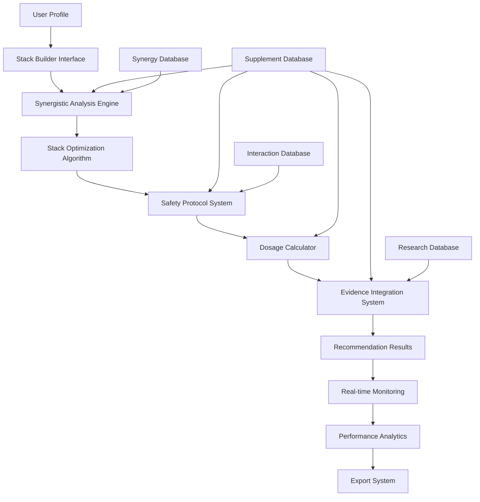

# Intelligent Supplement Stack System - Architecture Design

## Overview

The Intelligent Supplement Stack System is a comprehensive platform that analyzes synergistic effects, identifies optimal supplement combinations, and provides evidence-based recommendations with safety warnings and dosage protocols. This system builds upon the existing suplementor application architecture while adding advanced AI-powered stack optimization capabilities.

## Core Architecture

### 1. System Components

#### A. Synergistic Effect Analysis Engine
- **Purpose**: Analyzes and quantifies synergistic effects between supplements
- **Input**: Supplement profiles, interaction data, research evidence
- **Output**: Synergy scores, mechanism analysis, evidence ratings
- **Key Features**:
  - Multi-supplement synergy detection
  - Evidence-based scoring algorithm
  - Mechanism of action analysis
  - Safety profile assessment

#### B. Stack Optimization Algorithm
- **Purpose**: Identifies optimal supplement combinations based on multiple factors
- **Input**: User profile, health goals, constraints, available supplements
- **Output**: Ranked supplement stacks with scores and rationale
- **Key Features**:
  - Multi-objective optimization
  - Constraint satisfaction
  - Diversity maximization
  - Cost-effectiveness analysis

#### C. Enhanced Safety Protocol System
- **Purpose**: Comprehensive safety checking with contraindications and warnings
- **Input**: Supplement combinations, user profile, medications
- **Output**: Safety scores, warnings, contraindications, monitoring requirements
- **Key Features**:
  - Drug interaction analysis
  - Contraindication detection
  - Risk stratification
  - Monitoring protocol generation

#### D. Intelligent Dosage Calculator
- **Purpose**: Smart dosage calculation considering interactions and user factors
- **Input**: Supplement stack, user profile, interaction data
- **Output**: Optimized dosages, timing schedules, adjustment protocols
- **Key Features**:
  - Interaction-adjusted dosing
  - Bioavailability optimization
  - Timing optimization
  - Titration schedules

### 2. Data Flow Architecture



### 3. Integration with Existing Systems

#### A. Existing Component Integration
- **AI Recommendation Engine**: Enhanced with stack optimization capabilities
- **Drug Interaction Checker**: Extended for multi-supplement analysis
- **Supplement Interaction Network**: Upgraded for stack visualization
- **Evidence-based Research Service**: Integrated for real-time evidence

#### B. Data Model Extensions
- **SupplementStack Model**: New model for supplement combinations
- **StackInteraction Model**: Enhanced interaction tracking for stacks
- **UserStackProfile Model**: User-specific stack preferences and history
- **StackAnalytics Model**: Performance tracking and optimization data

### 4. API Architecture

#### A. Core Endpoints
```
POST   /api/v1/stacks/analyze          # Analyze supplement combinations
POST   /api/v1/stacks/optimize         # Generate optimal stacks
GET    /api/v1/stacks/recommendations  # Get personalized stack recommendations
POST   /api/v1/stacks/validate         # Validate stack safety
GET    /api/v1/stacks/{id}/analytics   # Get stack performance data
```

#### B. Real-time Endpoints
```
WebSocket /ws/stacks/monitor           # Real-time stack monitoring
POST   /api/v1/stacks/events           # Log stack-related events
```

### 5. Algorithm Architecture

#### A. Synergy Scoring Algorithm
1. **Pairwise Synergy Analysis**
   - Calculate interaction strength between supplement pairs
   - Evidence level weighting
   - Mechanism compatibility scoring

2. **Multi-Supplement Synergy Detection**
   - Network analysis for supplement relationships
   - Pathway interaction mapping
   - Additive vs multiplicative effect calculation

3. **Synergy Optimization**
   - Maximize beneficial interactions
   - Minimize antagonistic interactions
   - Optimal ratio determination

#### B. Stack Optimization Algorithm
1. **Multi-Objective Optimization**
   - Effectiveness maximization
   - Safety optimization
   - Cost minimization
   - User preference satisfaction

2. **Constraint Programming**
   - Maximum supplement limits
   - Budget constraints
   - Timing compatibility
   - Interaction avoidance

3. **Machine Learning Integration**
   - Historical success prediction
   - User feedback learning
   - Outcome optimization

### 6. Safety Architecture

#### A. Multi-Layer Safety System
1. **Level 1: Basic Compatibility**
   - Supplement-supplement interactions
   - Basic contraindications
   - Dosage range validation

2. **Level 2: Personalized Safety**
   - Medication interactions
   - Health condition considerations
   - Age and gender factors

3. **Level 3: Advanced Safety**
   - Multi-supplement interaction networks
   - Cumulative effect analysis
   - Long-term safety monitoring

#### B. Risk Stratification
- **Critical Risk**: Immediate contraindications requiring avoidance
- **High Risk**: Significant interactions requiring monitoring
- **Moderate Risk**: Minor interactions with recommendations
- **Low Risk**: Minimal concerns with optional monitoring

### 7. User Interface Architecture

#### A. Stack Builder Interface
- **Interactive Stack Construction**
  - Drag-and-drop supplement selection
  - Real-time synergy visualization
  - Instant safety feedback

- **Smart Recommendations**
  - AI-powered supplement suggestions
  - Evidence-based rationale
  - Alternative option exploration

#### B. Visualization Components
- **Enhanced Network Visualization**
  - Multi-supplement interaction networks
  - Synergy strength indicators
  - Safety warning overlays

- **Analytics Dashboard**
  - Stack performance tracking
  - Goal progress visualization
  - Cost-benefit analysis

### 8. Implementation Strategy

#### A. Phase 1: Core Engine Development
1. Synergistic Effect Analysis Engine
2. Stack Optimization Algorithm
3. Enhanced Safety Protocol System

#### B. Phase 2: Integration & Enhancement
1. Integration with existing services
2. Real-time monitoring system
3. Performance analytics dashboard

#### C. Phase 3: Advanced Features
1. Machine learning optimization
2. Export and sharing features
3. Mobile application support

### 9. Technology Stack

#### A. Backend Services
- **TypeScript/Node.js**: Core service implementation
- **MongoDB**: Supplement and interaction data storage
- **Redis**: Caching and real-time data
- **WebSocket**: Real-time communication

#### B. AI/ML Components
- **TensorFlow.js**: Synergy prediction models
- **Network Analysis**: Interaction graph algorithms
- **Optimization Libraries**: Constraint programming and multi-objective optimization

#### C. Frontend Integration
- **React/TypeScript**: User interface components
- **D3.js**: Advanced data visualizations
- **Web Workers**: Heavy computation handling

### 10. Monitoring and Analytics

#### A. Performance Metrics
- Stack effectiveness scores
- User adherence rates
- Goal achievement tracking
- Safety incident monitoring

#### B. System Analytics
- Algorithm performance metrics
- User behavior patterns
- Recommendation accuracy
- System usage statistics

This architecture provides a comprehensive, scalable foundation for an intelligent supplement combination system that leverages the existing suplementor infrastructure while adding advanced AI-powered capabilities for optimal stack recommendations.